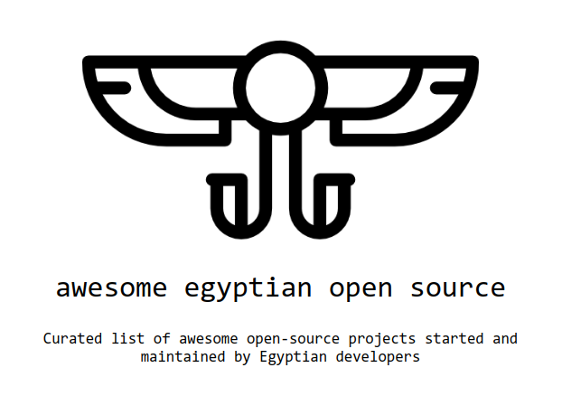

  

> A Curated list of awesome opensource projects started and maintained by Egyptian developers

[Logo credits](https://www.subpng.com/png-y509zn/)

### Why?

* Encourage open source initiatives taken both by Egyptian companies and independent Egyptian engineers.
* Help young developers, looking to contribute to their first open source project, find approachable projects, and easy access to mentorship and guidance in their own native language.
* An actual opensource list for listing opensource projects! Because the internet is full of old and obsolete news sites, magazines and google docs.
* Hiring? find great developers or companies for your next project! probably the best of the best are in this list.

### Where is my project?

Don't see your own or favorite project? check [CONTRIBUTING](CONTRIBUTING.md) for instructions on how to get on this list.

## Categories

- [Categories](#categories)
- [Projects](#projects)
  - [Browser Extensions](#browser-extensions)
  - [Chatbot Frameworks](#chatbot-frameworks)
  - [Developer Tools](#developer-tools)
  - [Devops](#devops)
  - [Fonts](#fonts)
  - [Frontend](#frontend)
    - [Frontend Libraries](#frontend-libraries)
    - [Frontend Scaffolders](#frontend-scaffolders)
  - [Web and Publishing](#web-and-publishing)
  - [Web Frameworks](#web-frameworks)
  - [Security and PenTesting](#security-and-pentesting)
  - [Test Automation and TDD](#test-automation-and-tdd)
  - [SDKs and Libraries](#sdks-and-libraries)
  - [Awesome Pages](#awesome-pages)
  - [Books](#books)
  - [Roadmap](#roadmap)
  - [Podcasts](#podcasts)
- [Communities](#communities)
- [Competitive Programming and Problem Solving](#competitive-programming-and-problem-solving)

<small><i><a href='http://ecotrust-canada.github.io/markdown-toc/'>Table of contents generated with markdown-toc</a></i></small>

## Projects

### Browser Extensions

* [KL13NT/ally-reads](https://github.com/KL13NT/ally-reads) - An accessibility suite giving you control over what you read. Modifies visual aspects at will to make content more readable. 
* [AnonTab](https://github.com/0xSobky/AnonTab) - AnonTab allows you to browse safely, anonymously and privately to any suspicious URLs from within your everyday browser.
* [kerolloz/follows-you-github](https://github.com/kerolloz/follows-you-github) A simple browser extension that shows a "follows you" label on a follower profile on GitHub.
* [HaramBlur](https://github.com/alganzory/HaramBlur) A Browser extension that enables you to navigate the web with respect for your Islamic values, protect your privacy and reduce browsing distractions by auto detecting and blurring "Haram" content.

### Chatbot Frameworks

* [RobustaStudio/bkit](https://github.com/RobustaStudio/bkit) - build a messenger bot using HTML.

### Developer Tools

* [LiveCodes](https://github.com/live-codes/livecodes) - A feature-rich, open-source, client-side code playground for React, Vue, Svelte, Solid, Typescript, Python, Go, Ruby, PHP and 90+ languages/frameworks.

### Devops

* [tactful-ai/helm-dashboard](https://github.com/tactful-ai/helm-dashboard) - Manage your helm charts and releases visually.
* [tactful-ai/on-prem](https://github.com/tactful-ai/on-prem) - Quickly provision and operate your on-premises cluster with just a single click, leveraging Rancher for cluster management equipped with dynamic provisioning and monitoring tools such as Prometheus and Grafana.
* [tactful-ai/helm2readme](https://github.com/tactful-ai/helm2readme) - Auto-generates customized documentation from helm charts into markdown files. The resulting files contain metadata about their respective chart and a table with each of the chart's values, their defaults, and an optional description parsed from comments.

### Fonts

* [alif-type/Amiri](https://github.com/alif-type/amiri) - Amiri Font Project. Amiri is a classical Arabic typeface in Naskh style for typesetting books and other running text.
* [Gue3bara/Cairo](https://github.com/Gue3bara/Cairo) - Cairo is a contemporary Arabic and Latin typeface family. Mohamed Gaber extended the famous Latin typeface family Titillum Web to support the Arabic script, with a design that is based on the Kufi calligraphic style. 

### Frontend 

  #### Frontend Libraries

  + [logaretm/vee-validate](https://github.com/logaretm/vee-validate) - Template Driven Validation Framework for Vue.js

  #### Frontend Scaffolders

  + [ahmadalfy/workflow](https://github.com/ahmadalfy/workflow) - Modern front-end workflow using Pugjs, PostCSS and Snowpack

### Web and Publishing

* [themsaid/wink](https://github.com/themsaid/wink) - A Laravel-based publishing platform
* [robusta-studio/resala](https://github.com/RobustaStudio/Resala) - Resala is a PHP & Laravel Package, (Designed to add support to your laravel or just native php app for sending SMS using local operators in the MENA region Like `Vodafone`,    `Infopib`,    `Conneckio`)
* [swvl/express-versioned-route](https://github.com/swvl/express-versioned-route) - Simple express.js 4.x extension, to add support for versioned routes
* [Ahmed-Ali/JSONExport](https://github.com/Ahmed-Ali/JSONExport) - desktop application for Mac OS X which enables you to export JSON objects as model classes with their associated constructors, utility methods, setters and getters in your favorite language.
* [piscibus/notifly](https://github.com/piscibus/notifly) - Notifly is a Laravel Package, that replaces Laravel's database notifications to allow aggregating notification actors like Facebook. -- (John, Jane Doe, and 8 others reacted to your photo.)
* [ixahmedxi/noodle](https://github.com/ixahmedxi/noodle) - Noodle is an open-source platform that streamlines student education management by consolidating various tools into one platform.
* [alash3al/sqler](https://github.com/alash3al/sqler) - `SQL-er` is a tiny portable server enables you to write APIs using SQL query to be executed when anyone hits it.
* [logaretm/vee-validate](https://github.com/logaretm/vee-validate) - VeeValidate is the most popular Vue.js form library. It takes care of value tracking, validation, errors, submissions and more.

### Web Frameworks

* [gogearbox/gearbox](https://github.com/gogearbox/gearbox) - gearbox is a web framework written in Go with a focus on high performance and memory optimization
* [ahegazy/php-mvc-skeleton](https://github.com/ahegazy/php-mvc-skeleton) - A PHP OOP web application skeleton that uses MVC architectural pattern to create a basic application that contains login and multi language systems and can be used in any web project.
* [adhamsalama/simpleapi](https://github.com/adhamsalama/simpleapi) - A minimalistic, unopinionated web framework for Python, inspired by FastAPI & Flask. (for educational purposes)
* [hasssanezzz/PyMicroHTTP](https://github.com/hasssanezzz/PyMicroHTTP) - a lightweight, flexible HTTP framework built from scratch in Python. It provides a simple way to create HTTP services without heavy external dependencies, making it ideal for learning purposes or small projects.

### Security and PenTesting

* [aboul3la/Sublist3r](https://github.com/aboul3la/Sublist3r) - Fast subdomains enumeration tool for penetration testers

### Test Automation and TDD

* [MohabMohie/SHAFT_ENGINE](https://github.com/MohabMohie/SHAFT_ENGINE) - a Test Automation Engine that provides a unified high-level interface to any of the underlying test automation frameworks.

### SDKs and Libraries

* [fawry-api/fawry](https://github.com/fawry-api/fawry) - A plug-and-play library to interface with Fawry's payment gateway API (charge, refund, payment status, service callback v2) - (مكتبة بسيطة للتواصل مع شبكة خدمات الدفع الإلكتروني فوري (دفع٬ استرجاع٬ حالة الدفع٬ رد السيرفر
* [Decentralized-Internet](https://github.com/Lonero-Team/Decentralized-Internet) - A SDK/library for decentralized web and distributing computing projects

### Awesome Pages

* [AI-ML-Driven-Companies-In-Egypt](https://github.com/harryadel/AI-ML-Driven-Companies-In-Egypt) - A curated list of artificial intelligence and machine learning companies in Egypt.
* [Summer Internships for Egyptian Students](https://github.com/ACM-Alexandria-SC/Internships-in-Egypt) - A curated list of summer internships for Egyptian students. Maintained by ACM Alexandria Student Chapter.

### Books

* [Software Environment Concepts](https://github.com/Amr2812/software-environment-concepts) - A glossary ebook for software concepts in topics like frontend, backend, databases, cloud & etc...

### Roadmap

* [Frontend Developer Roadmap](https://github.com/FADL285/Front-End-Development-Roadmap) - Step by step guide to becoming a modern frontend developer.
* [Moataz-Elmesmary/Data-Science-Roadmap](https://github.com/Moataz-Elmesmary/Data-Science-Roadmap) - Data Science Roadmap from A to Z
* [Frontend learning and development map](https://docs.google.com/spreadsheets/d/1eS2x4w173jBNQn_rKa8UGBPWXqLq1vK_MumvpGC9xlw/edit?usp=sharing) Many existing roadmaps for entering specific fields lack detailed guidance, leaving learners to explore topics without diving deeply. This sheet aims to provide practical, work-related insights and does not necessarily refer to seniority levels, offering individuals a path to focused growth. Created by [Ahmed El-Alfy](https://twitter.com/ahmadalfy).

### Podcasts

* [Ask Developer Podcast](https://www.youtube.com/@bashmohandes) - Maintained by [Mohamed Elsherif](https://twitter.com/Bashmohandes).
* [Tech Podcast بالعربي](https://www.youtube.com/@ahmdelemam) Maintained by [Ahmed El-Imam](https://twitter.com/ahmdelemam).
* [null ++](https://www.youtube.com/channel/UC6FtBjNpRc7KCXVtXlshi5g) - Maintained by [Mohamed Luay](https://twitter.com/_mluay) and [Ahmed El-Alfy](https://twitter.com/ahmadalfy).

## Communities 

* [Egyptian Geeks](https://www.facebook.com/groups/172338516139198)- Our mission is to curate and share high-quality tech-related content, ensuring valuable information reaches those in search of it within our community.
* [CSE knowledge exchange](https://www.facebook.com/groups/892792400815703) - A group where you can learn and share general info about trending cse topics, jobs, internships, and learning opportunities.
* [Egyptian AI & Big Data Geeks](https://www.facebook.com/groups/1596832580575937) - A group for Egyptian engineers working in the area of big data, data science and AI to ask, share and discuss news, articles, vacancies and events in Egypt.
* [Active Courses](https://discord.gg/y6vUhDDX) - This Discord server is dedicated to studying computer science subjects collectively, following a synchronized approach to mimic a college-like environment.
* [Dotnet Egypt](https://web.facebook.com/groups/dotnetegypt) - A facebook group for C# and .Net developers to aggregate problems and post solutions
* [Lean Startup Circle](https://web.facebook.com/groups/LeanStartupCircleEgypt) - Lean Startup is a methodology for developing businesses and products that aims to shorten product development cycles and rapidly discover if a proposed business model is viable, this facebook group is a community for developers, VCs and all people involved in startups to discuss the Lean Startup paradigm and share their knowledge.
* [AWS Egypt Club](https://web.facebook.com/groups/aws.egypt.club) - A facebook group to discuss all things AWS and Networking/Cloud Computing.
* [Automatest - Software Test Automation Hub](https://web.facebook.com/groups/Automatest) - A facebook group dedicated to Automated Software Testing
* [Blockchain Egypt](https://web.facebook.com/groups/BlockchainEgypt) - Facebook group for Blockchain enthusiasts

## Competitive Programming and Problem Solving

* [Arabic Competitive Programming](https://www.youtube.com/@ArabicCompetitiveProgramming) - Competitive Programming mentoring channel and data structure and algorithms tutorials in Arabic. Also guiding videos and talks in software engineering. Maintained by [Mostafa Saad](https://t.me/mostvision).
* [Junior Training Sheet V7.0](https://docs.google.com/spreadsheets/d/1iJZWP2nS_OB3kCTjq8L6TrJJ4o-5lhxDOyTaocSYc-k/edit?usp=sharing) - Overall ~950 problems for newcomers to problem solving. Maintained by [Mostafa Saad](https://t.me/mostvision).
* [Interviews Warmup Sheet - V2.0] -  For developers targeting the market needs and technical interviews in companies. Maintained by [Mostafa Saad](https://t.me/mostvision).
